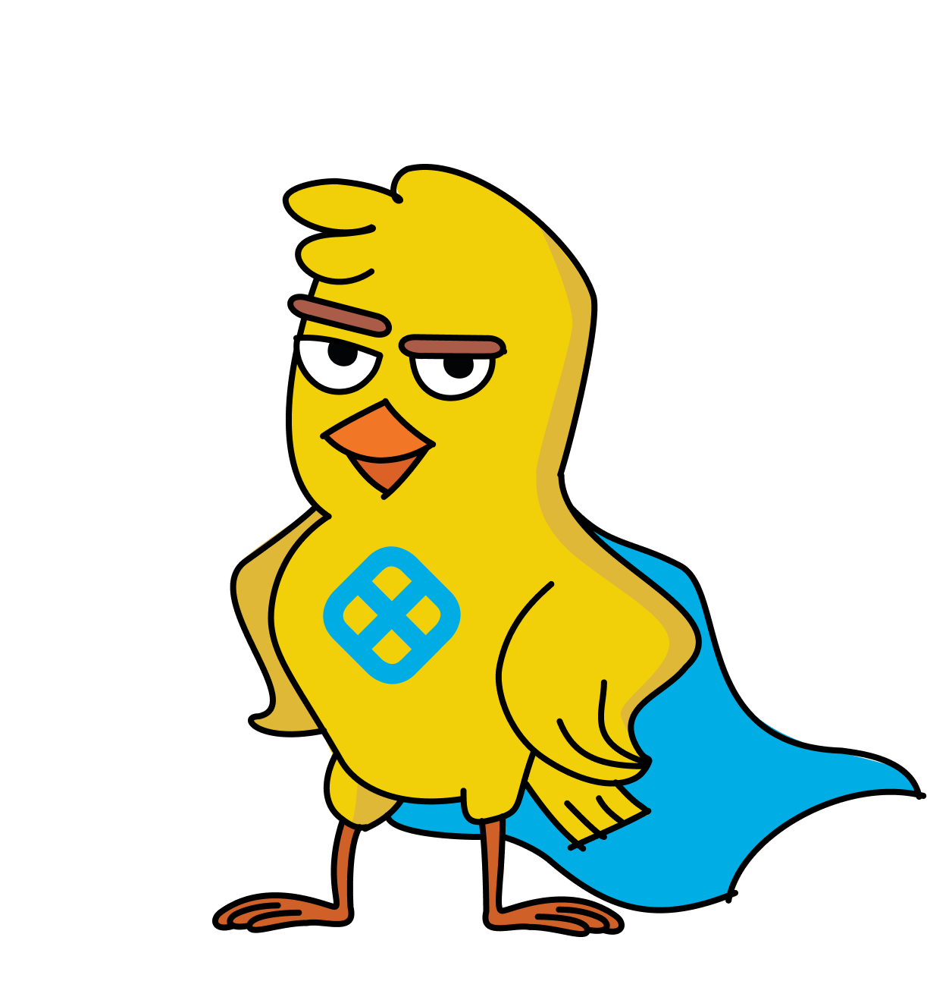

<p align="center">
  
</p>

<h1 align="center">Harness Demo App</h1>

<p align="center">
  <strong>AI-Powered CI/CD with On-Prem Code Review</strong><br>
  A complete Harness CI/CD pipeline with Gemma 4 AI security gate, canary deployments, and zero data exfiltration.
</p>

<p align="center">
  
</p>

---

## What This Is

A FastAPI application deployed to Kubernetes via Harness CI/CD, with an AI-powered code review gate using Google Gemma 4 running on-prem via Ollama. Built as a technical exercise for a Harness Solutions Engineer interview.

**The key insight**: Enterprise customers can get AI-powered security scanning in their CI/CD pipeline without sending a single line of code to the cloud.

## Architecture

```
Developer pushes code
  --> GitHub webhook
  --> Harness CI/CD Pipeline
        |
        +--> AI Code Review (Gemma 4 26B via Ollama - on-prem)
        |      Returns structured JSON: findings, severity, verdict
        |      CRITICAL security issues --> pipeline BLOCKED
        |
        +--> Security Gate
        |      Reads AI verdict, enforces pass/fail
        |
        +--> Run Tests (pytest)
        |
        +--> Build & Push Docker Image (templatized step)
        |
        +--> Canary Deploy (1 pod)
        +--> Canary Delete
        +--> Rolling Deploy (full rollout)
  --> App live on Kubernetes
```

## Components

| Component | Technology | Where it runs |
|-----------|-----------|---------------|
| Application | Python FastAPI | Kubernetes pod |
| CI/CD Pipeline | Harness | SaaS control plane |
| Build Infrastructure | Harness Delegate | Kubernetes (self-managed) |
| AI Code Review | Gemma 4 26B QAT | On-prem via Ollama |
| Container Registry | DockerHub | Cloud |
| Source Control | GitHub | Cloud |
| Deployment Strategy | Canary + Rolling | Kubernetes |

## Features

- **AI Security Gate**: Gemma 4 reviews every PR for OWASP Top 10 vulnerabilities. SQL injection, command injection, path traversal, hardcoded secrets, ReDoS -- all caught and blocked.
- **Structured JSON Output**: The AI returns structured findings (not markdown), parsed reliably every time. Results appear in the Harness Output tab.
- **Canary Deployments**: New versions deploy to a single canary pod first, then roll out to full replicas with automatic rollback on failure.
- **Pipeline Templates**: The Docker build step is templatized for reuse across teams.
- **Git Triggers**: Pipeline runs automatically on push to main and on PR open/update.
- **Branch Protection**: GitHub requires the AI review check to pass before PRs can be merged.
- **Harness MCP Server**: AI-native platform interaction via Model Context Protocol.

## AI Code Review Experiments

We tested 10 vulnerability scenarios against the AI reviewer. Results:

| # | Scenario | Detected? | Severity |
|---|----------|-----------|----------|
| 1 | Hardcoded secrets | Yes | CRITICAL |
| 2 | Command injection | Yes | CRITICAL |
| 3 | Open redirect | Yes | CRITICAL |
| 4 | Debug endpoint (env vars) | Yes | CRITICAL |
| 5 | Path traversal | Yes | CRITICAL |
| 6 | Logging passwords | Yes | CRITICAL x2 |
| 7 | Insecure CORS | Yes | WARNING (CRITICAL with prescriptive prompt) |
| 8 | ReDoS | Yes | CRITICAL |
| 9 | Clean feature | Passed correctly | No false positive |
| 10 | Race condition | Partial | WARNING |

**7/10 blocked, 0 false positives, 0 false negatives on security-critical issues.**

Full analysis with model comparisons (26B QAT vs 31B) and prompt engineering results: [docs/ai-code-review-experiments.md](docs/ai-code-review-experiments.md)

## Running the Demo

### Prerequisites

- Docker Desktop with Kubernetes enabled
- Ollama running with `gemma4:26b-a4b-it-qat` model
- Harness account with delegate installed
- GitHub and DockerHub accounts

### Demo Scripts

```bash
# Inject a SQL vulnerability, open a PR -- watch Gemma block it
./scripts/demo-start.sh

# Fix the vulnerability, push -- watch Gemma approve it
./scripts/demo-fix.sh

# Clean up for next demo run
./scripts/demo-reset.sh
```

### Local Development

```bash
python3 -m venv .venv
source .venv/bin/activate
pip install -r requirements.txt
pytest -v tests/
uvicorn app.main:app --host 0.0.0.0 --port 8080
```

## Project Structure

```
harness-demo/
  app/
    main.py              # FastAPI application
    config.py            # Environment-based configuration
    static/              # Static assets (Harness logo)
    templates/           # Jinja2 HTML templates
  tests/
    test_main.py         # 9 pytest tests
  scripts/
    ai_review.py         # Gemma 4 AI code review (JSON mode)
    demo-start.sh        # Inject vulnerability for demo
    demo-fix.sh          # Fix vulnerability for demo
    demo-reset.sh        # Reset demo state
  k8s/
    deployment.yaml      # K8s deployment with probes
    service.yaml         # NodePort service
    namespace.yaml       # Dedicated namespace
  docs/
    demo-talk-track.md   # 5-10 minute demo script
    ai-code-review-experiments.md  # 10 experiment results
  Dockerfile             # Single-stage Python build
  requirements.txt       # Python dependencies
```

## Issues & Findings

During the build, we documented 9 platform issues with root causes and fixes. Highlights:

- Kaniko multi-stage Dockerfile bug (`device or resource busy`)
- Harness Cloud requires credit card with no self-service upgrade path
- Output variables lost when step exits non-zero (appended capture lines)
- UI 404s with `/admin/` vs `/all/` URL routing

---

<p align="center">
  Built with Claude Code, Harness CI/CD, and Gemma 4 via Ollama<br>
  <em>No code left the network.</em>
</p>
