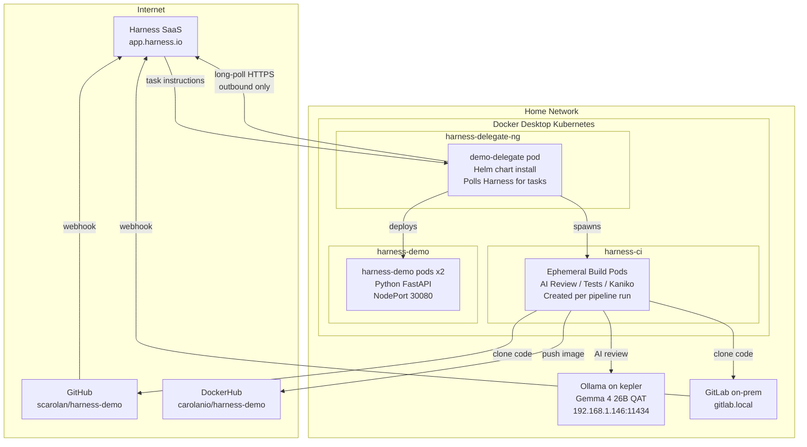
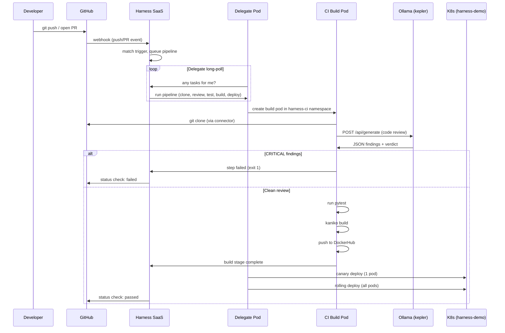
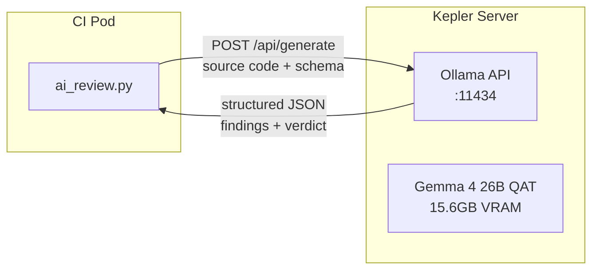
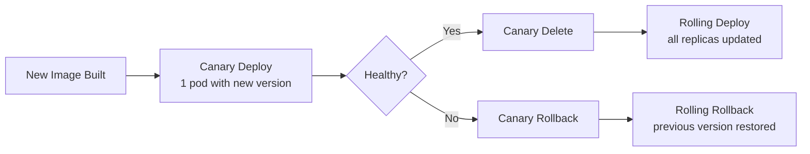

# Architecture

## System Overview



## Communication Model

The delegate initiates all connections outbound. Harness SaaS never calls in.



## Kubernetes Namespaces

| Namespace | Purpose | Contents |
|-----------|---------|----------|
| `harness-delegate-ng` | Delegate runtime | `demo-delegate` pod + auto-upgrader jobs |
| `harness-ci` | CI build infrastructure | Ephemeral pods per pipeline run (empty between runs) |
| `harness-demo` | Python app deployment | 2 replicas, NodePort 30080 |
| `harness-petclinic` | Java app deployment | 2 replicas, NodePort 30081 |

## The Delegate

The delegate is the bridge between Harness SaaS and your local infrastructure. Key properties:

- **Outbound only** -- it polls `https://app.harness.io`, no inbound ports or firewall holes needed
- **Installed via Helm** -- `harness-delegate-ng` chart, single `helm install` command
- **Auto-upgrades** -- periodic upgrader jobs check for new versions
- **Network access** -- can reach everything on the home network (GitLab, Ollama) plus the internet (GitHub, DockerHub)
- **Authenticated** -- registered to the Harness account with a delegate token

```bash
# How the delegate was installed
helm repo add harness-delegate \
  https://app.harness.io/storage/harness-download/delegate-helm-chart/
helm install demo-delegate harness-delegate/harness-delegate-ng \
  --namespace harness-delegate-ng \
  --set accountId=<ACCOUNT_ID> \
  --set delegateToken=<TOKEN_FROM_UI> \
  --set delegateName=demo-delegate \
  --set managerEndpoint=https://app.harness.io
```

## CI Build Pods

Each pipeline run creates ephemeral containers in the `harness-ci` namespace:

| Step | Container Image | What It Does |
|------|----------------|--------------|
| AI Code Review | `python:3.12-slim` | Sends code to Ollama, parses JSON verdict |
| Security Gate | `alpine` | Reads verdict, blocks on CRITICAL |
| Run Tests | `python:3.12-slim` | `pytest` (Python) or `mvnw test` (Java) |
| Build & Push | Kaniko | Builds Docker image, pushes to DockerHub |

These pods are created at pipeline start and destroyed when it finishes. The `harness-ci` namespace is empty between runs.

## On-Prem AI Review



- Model runs permanently on `kepler` (192.168.1.146) with keep-alive
- Context window: 16,384 tokens (set via `num_ctx`)
- Structured JSON output via Ollama schema enforcement
- Review time: ~15-25 seconds per run
- Retry logic: up to 3 attempts on JSON parse failure
- No code leaves the network

## Deployment Strategy


